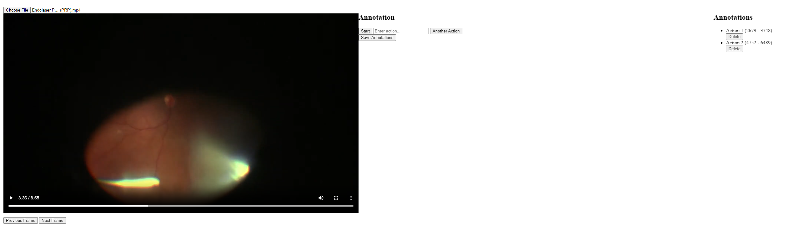

# Video Annotation Tool

This tool allows users to annotate actions in video files by specifying start and end frames for each action.

## How to Use

1. **Load a Video File**
   - Click the "Choose File" button to select and load a video file from your computer.

2. **Navigate the Video**
   - Use the "Previous Frame" and "Next Frame" buttons to move frame by frame.
   - Alternatively, use the left and right arrow keys on your keyboard for frame-by-frame navigation.

3. **Start an Action Annotation**
   - Navigate to the initial frame of the action you want to annotate.
   - Click the "Start" button to mark the beginning of the action.

4. **Name the Action**
   - In the "Enter action..." text field, type a descriptive name for the action.

5. **End the Action Annotation**
   - Navigate to the frame corresponding to the end of the action.

6. **Save the Action**
   - Click the "Another Action" button. This will save the current action and add it to the list on the right side of the screen.

7. **Manage Annotations**
   - You can see all your annotations listed on the right side of the screen.
   - To remove an annotation, click the "Delete" button next to the specific action in the list.

8. **Save All Annotations**
   - When you're finished annotating, click the "Save Annotations" button.
   - This will automatically generate and download a JSON file containing all your annotations.

## Tips

- You can add multiple annotations before saving.
- Make sure to click "Start" before adding each new action.
- The JSON file will include the video file name and all annotated actions with their start and end frames.
- You can load the JSON file later to review or continue your annotations (feature to be implemented).

## Requirements

- This tool works best with modern web browsers that support HTML5 video playback.
- Ensure your browser allows file downloads for the annotation saving feature to work.

## Troubleshooting

- If the video doesn't load, make sure it's in a format supported by your browser (e.g., MP4, WebM).
- If frame navigation isn't precise, this may be due to limitations in HTML5 video seeking. For more precise control, consider using a specialized video player.
